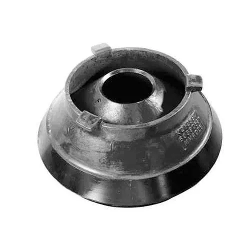
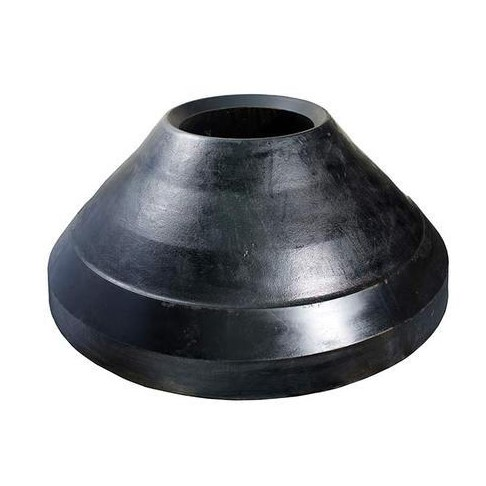
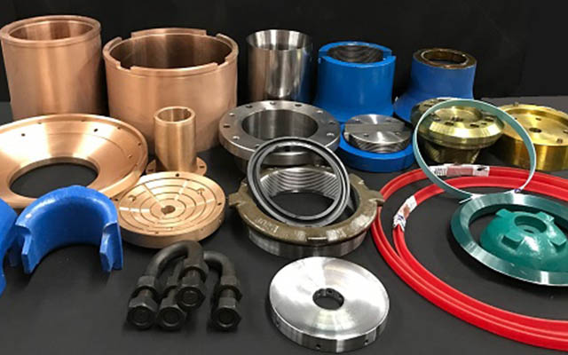
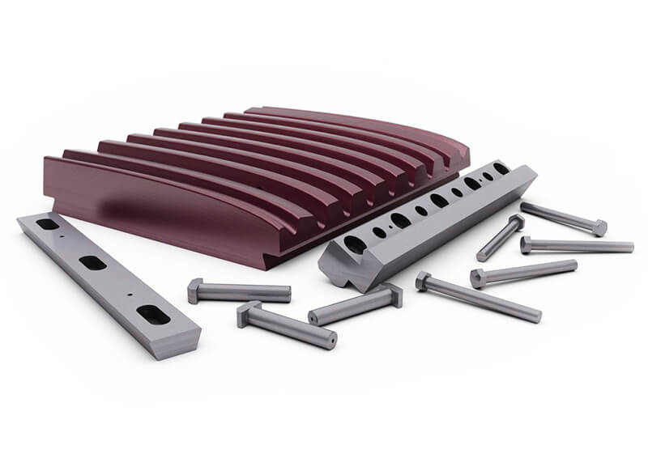
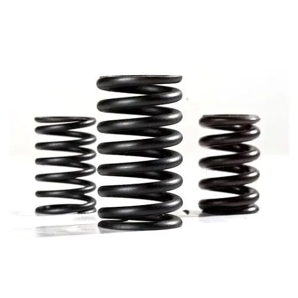

<!DOCTYPE html>
<html lang="en">
<head>
    <meta charset="UTF-8">
    <meta http-equiv="X-UA-Compatible" content="IE=edge">
    <meta name="viewport" content="width=device-width, initial-scale=1.0">
    <title>Document</title>
    <link rel="stylesheet" href="svm.css">
    
</head>
<body>
    <a href="svm contact.html">
<i class="fa-solid fa-phone"></i>
</a>
    

        
    

    

        <a href="svm.html" target="_self"><i class="fa-solid fa-house-chimney"></i>  HOME</a>
        <a href="#about"><i class="fa-solid fa-address-card"></i>  ABOUT US</a>
        <a  href="our products.html" target="_self"><i class="fa-solid fa-cart-shopping"></i>  OUR PRODUCTS</a>
        <a href="svm contact.html" target="_self" style="float:right"><i class="fa-solid fa-envelope"></i>  CONTACT US</a>
    

<!--------------element-------------->

    

        

            

            <h1 class="heading-element">Get The Top Notch </h1>
            <h2 class="heading-element1">Services within one day </h2>
            
Our efficient business team will assist you in every matter in a record time!
 
        

        

            <a href="svm contact.html"><button class="btn-element fill-element">CONTACT NOW</button></a>
        

    

<!-----------------about-------------------->

    

        

            

            

            

                <h1 class="sub-title">About US</h1>
                
Shree Vankhandi Mahadev – Manufacturer of jaw plates, concave mantle & crusher concave in Faridabad, Haryana. We hold “Pursuing the SVM and it’s Quality” as our management concept all the time. Relying on absorbing world leading crushing processing technology, advanced management and quality control system, as well as our full efforts have made our company earn highr reputation among our customers.

                   We are the leading Supplier of Manganese Steel wear resistant parts & all critical components of cone crusher including the bronze bushes. Premium Quality Conveyor Belts in Plain & Chevron profile, Conveyor Rollers, Brackets, Drum Pulleys, Speed Reducer, Manganese Steel Casting, Bronze Casting, CI Casting…
                

            

        

    

<!---------------------PORTFOLIO----------------->

    

        <h1 class="sub-title">What We Provide</h1>
        

            

                
                

                    <h3>Jaw Plates</h3>
                    
The most frequently replaced wear parts of the jaw crusher.

                        <a href="#"><i class="fa-solid fa-arrow-up-right-from-square"></i></a>
                

            

            

                
                

                    <h3>Concave Mantle</h3>
                    
The mantle on a crusher is a concave surface that is part of the outer casing of the crusher.

                        <a href="#"><i class="fa-solid fa-arrow-up-right-from-square"></i></a>
                

            

            

                
                

                    <h3>Crusher Concave</h3>
                    
The standard type of liner ever since the gyratory crusher came into popular use.

                        <a href="#"><i class="fa-solid fa-arrow-up-right-from-square"></i></a>
                

            

        

    

<!-----------slide image--------->

    

    
1 / 3

    
    
Caption Text

    

    
    

    
2 / 3

    
    
Caption Two

    

    
    

    
3 / 3

    
    
Caption Three

    

    
    <a class="prev" onclick="plusSlides(-1)">❮</a>
    <a class="next" onclick="plusSlides(1)">❯</a>
    
    

     
    
    

     
     
     
    

    <!-- Heading-->    
    

        

            <!-- Form -->
            
             
            
            <!-- Displaying text at
                the center of the box-->
            

                Cast Iron Stone Crusher Spare Parts and Other
            

        

        

            
            <!-- Email -->
            
             
            
                <!-- Displaying text at
                the center of the box-->
            

                Toggle Plate
            

        

        

            
             
            
            <!-- Displaying text at
                the center of the box-->
            

                Crusher Spring
            

        

    

    

        

            <h1 class="sub-title-2">Why Choose Us</h1>
            

            

                

                    <i class="fa-solid fa-warehouse"></i>
                    <h2>Production Capacity</h2>
                    
 Due to SVM's strong production capacity, we can complete customer parts orders on time
                    

                

                

                    <i class="fa-solid fa-hand-holding-dollar"></i>
                    <h2>Competitive Price</h2>
                    
 SVM™ supplies reliable yet affordable wear solutions, we are committed to reduce the cost of mining processing per ton and minimize the equipment downtime.
                    

                

                

                    <i class="fa-solid fa-tags"></i>
                    <h2>Premium Quality</h2>
                    
 Certified by multiple customers, the metallic and rubber spare parts supplied by SVM™ have significantly improved in terms of service life and adaptability.
                    

                

            

        

    

    
    

        

            

                

                    <h4>Looking for aftermarket parts?</h4>
                    <h1 class="sub-title-1">WE ARE HERE TO HELP!</h1>
                    
Get a free quotation today!

                    
<i class="fa-solid fa-phone"></i>+91-8377066590

                    
<i class="fa-solid fa-paper-plane"></i>nitin4uagrawal@gmail.com

                    
<i class="fa-sharp fa-solid fa-location-dot"></i>Gali No.3  Raghuveer Colony, Ballabgarh , Faridabad, ,121004, Haryana

                    

                    

                        
Contact us through the information above, or submit the enquiry form on the right. Our experts will get back to you with a suggestion or quotation in 12 hours, provide you with our most competitive prices and best services.

                        

                    

                

                    <form name="submit-to-google-sheet">
                        <input type="text" name="Name" placeholder="Your Name*" required>
                        <input type="text" name="Company name" placeholder="Company Name*" required>
                        <input type="email" name="Email" placeholder="Your Email*" required>
                        <input type="number" name="number" placeholder="Phone Number*" required>
                        <textarea name="Message" rows="6" placeholder="Your Message*"></textarea>
                        <button type="submit" class="btn btn2">Submit</button>
                    </form>
                    
                

            

            
Copyright © 2023 SVM | Powered by SVM®

        

    

    
    
    
</body>
</html>
